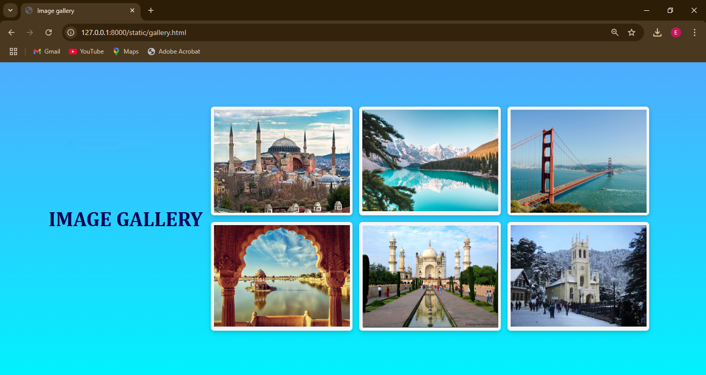
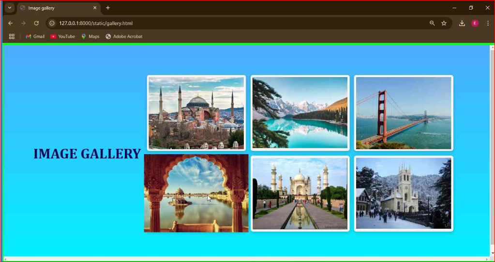

# Ex.08 Design of Interactive Image Gallery
# Date:
# AIM:
To design a web application for an inteactive image gallery with minimum five images.

# DESIGN STEPS:
## Step 1:
Clone the github repository and create Django admin interface.

## Step 2:
Change settings.py file to allow request from all hosts.

## Step 3:
Use CSS for positioning and styling.

## Step 4:
Write JavaScript program for implementing interactivity.

## Step 5:
Validate the HTML and CSS code.

## Step 6:
Publish the website in the given URL.

# PROGRAM :
```
gallery.html:

<!DOCTYPE html>
<html lang="en">
<head>
    <meta charset="UTF-8">
    <meta name="viewport" content="width=device-width, initial-scale=1.0">
    <title>Image gallery</title>
    <link rel="stylesheet" href="style.css">
    <link rel="stylesheet" href="https://cdnjs.cloudflare.com/ajax/libs/font-awesome/5.15.3/css/all.min.css"/>
</head>
<body>
  <h1 style="font-size:50px; font-family:Cambria, Cochin, Georgia, Times, 'Times New Roman', serif;font-weight:bolder;color-scheme:initial;color:rgb(7, 7, 83);">IMAGE GALLERY</h1>
  <div class="wrapper">
    <div class="gallery">
      <div class="image"><span></span></div>
      <div class="image"><span></span></div>
      <div class="image"><span></span></div>
      <div class="image"><span></span></div>
      <div class="image"><span></span></div>
      <div class="image"><span></span></div>
    </div>
  </div>
  <div class="preview-box">
    <div class="details">
      <span class="title">Image <p class="current-img"></p> of <p class="total-img"></p></span>
      <span class="icon fas fa-times"></span>
    </div>
    <div class="image-box">
      <div class="slide prev"><i class="fas fa-angle-left"></i></div>
      <div class="slide next"><i class="fas fa-angle-right"></i></div>
      
    </div>
  </div>
  <div class="shadow"></div>

  <script src="script.js"></script>

</body>
</html>

style.css:

*{
  margin: 0;
  padding: 0;
  box-sizing: border-box;
  font-family: 'Poppins', sans-serif;
}
::selection{
  color: #fff;
  background: #007bff;
}
body{
  padding: 10px;
  display: flex;
  align-items: center;
  justify-content: center;
  min-height: 100vh;
  background: linear-gradient(to bottom ,#4facfe,#00f2fe);
  font-family: Arial, Helvetica, sans-serif;
  text-align: center;
}
.heading{
  font-size: 2rem;
  font-weight: bold;
  margin: 20px 0;
}
.wrapper{
  max-width: 1100px;
}
.gallery{
  display: grid;
  grid-template-columns: repeat(auto-fit, minmax(300px,1fr));
  gap: 16px;
  padding: 20px;
  max-width: 1200px;
  margin:0 auto;
  flex-wrap: wrap;
}
.gallery .image{
  padding: 7px;
  width: 100%;
  height: auto;
  border-radius: 8px;
  box-shadow: 0px 4px 12px rgba(0,0,0,0.2);
  transition: transform 0.3s ease-in-out;
  background-color: whitesmoke;
}
.gallery .image span{
  display: flex;
  width: 100%;
  
}
.gallery .image img{
  width: 100%;
  vertical-align: middle;
  transition: all 0.3s ease;
}
.gallery .image:hover img{
  transform: scale(1.1);
}

.preview-box{
  position: fixed;
  top: 50%;
  left: 50%;
  transform: translate(-50%, -50%) scale(0.9);
  background: #fff;
  max-width: 700px;
  width: 100%;
  z-index: 5;
  opacity: 0;
  pointer-events: none;
  border-radius: 3px;
  padding: 0 5px 5px 5px;
  box-shadow: 0px 0px 15px rgba(0,0,0,0.2);
}
.preview-box.show{
  opacity: 1;
  pointer-events: auto;
  transform: translate(-50%, -50%) scale(1);
  transition: all 0.3s ease;
}
.preview-box .details{
  display: flex;
  align-items: center;
  padding: 12px 15px 12px 10px;
  justify-content: space-between;
}
.preview-box .details .title{
  display: flex;
  font-size: 18px;
  font-weight: 400;
}
.details .title p{
  margin: 0 5px;
}
.details .title p.current-img{
  font-weight: 500;
}
.details .icon{
  color: #007bff;
  font-size: 20px;
  cursor: pointer;
}
.preview-box .image-box{
  display: flex;
  width: 100%;
  position: relative;
}
.image-box .slide{
  position: absolute;
  top: 50%;
  transform: translateY(-50%);
  color: #fff;
  font-size: 30px;
  cursor: pointer;
  height: 50px;
  width: 60px;
  line-height: 50px;
  text-align: center;
  border-radius: 3px;
}
.slide.prev{
  left: 0px;
}
.slide.next{
  right: 0px;
}
.image-box img{
  width: 100%;
  border-radius: 0 0 3px 3px;
}
.shadow{
  position: fixed;
  top: 0;
  left: 0;
  height: 100%;
  width: 100%;
  z-index: 2;
  display: none;
  background: rgba(0,0,0,0.45);
}

script.js:

const gallery  = document.querySelectorAll(".image"),
previewBox = document.querySelector(".preview-box"),
previewImg = previewBox.querySelector("img"),
closeIcon = previewBox.querySelector(".icon"),
currentImg = previewBox.querySelector(".current-img"),
totalImg = previewBox.querySelector(".total-img"),
shadow = document.querySelector(".shadow");

window.onload = ()=>{
    for (let i = 0; i < gallery.length; i++) {
        totalImg.textContent = gallery.length; 
        let newIndex = i; 
        let clickedImgIndex; 
        
        gallery[i].onclick = () =>{
            clickedImgIndex = i; 
            function preview(){
                currentImg.textContent = newIndex + 1;
                let imageURL = gallery[newIndex].querySelector("img").src; 
                previewImg.src = imageURL; 
            }
            preview(); 
    
            const prevBtn = document.querySelector(".prev");
            const nextBtn = document.querySelector(".next");
            if(newIndex == 0){ 
                prevBtn.style.display = "none"; 
            }
            if(newIndex >= gallery.length - 1){ 
                nextBtn.style.display = "none"; 
            }
            prevBtn.onclick = ()=>{ 
                newIndex--; //decrement index
                if(newIndex == 0){
                    preview(); 
                    prevBtn.style.display = "none"; 
                }else{
                    preview();
                    nextBtn.style.display = "block";
                } 
            }
            nextBtn.onclick = ()=>{ 
                newIndex++; //increment index
                if(newIndex >= gallery.length - 1){
                    preview(); 
                    nextBtn.style.display = "none";
                }else{
                    preview(); 
                    prevBtn.style.display = "block";
                }
            }
            document.querySelector("body").style.overflow = "hidden";
            previewBox.classList.add("show"); 
            shadow.style.display = "block"; 
            closeIcon.onclick = ()=>{
                newIndex = clickedImgIndex; //assigning user first clicked img index to newIndex
                prevBtn.style.display = "block"; 
                nextBtn.style.display = "block";
                previewBox.classList.remove("show");
                shadow.style.display = "none";
                document.querySelector("body").style.overflow = "scroll";
            }
        }
        
    } 
}
```
# OUTPUT:


.png>)
.png>)
.png>)


# RESULT:
The program for designing an interactive image gallery using HTML, CSS and JavaScript is executed successfully.
